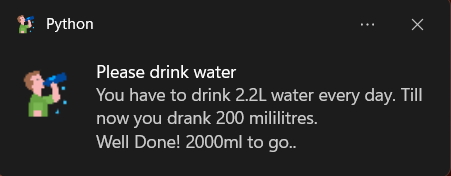

# Drink water desktop notifier

---
## Description
 - On average every person should drink 2.2L of water everyday. This notification helps in reminding.
 - It also calculates the amount of water you drank since morning and how much is left for a day.

---
## Python packages
### `Time`
- Python time package can be used by "import time" command.
- To learn more about time library [https://docs.python.org/3/library/time.html](https://docs.python.org/3/library/time.html).

### `Notification`
- Run command "pip install plyer" in terminal.
- Python desktop notification module can be imported using command "from plyer import notification".
- To learn more about plyer [https://www.geeksforgeeks.org/python-desktop-notifier-using-plyer-module/](https://www.geeksforgeeks.org/python-desktop-notifier-using-plyer-module/).
  
---

